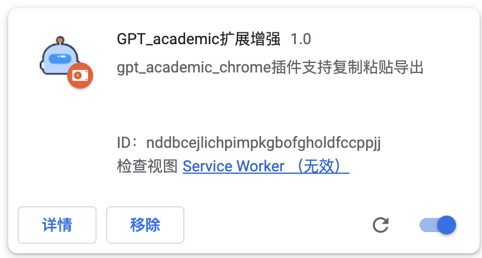
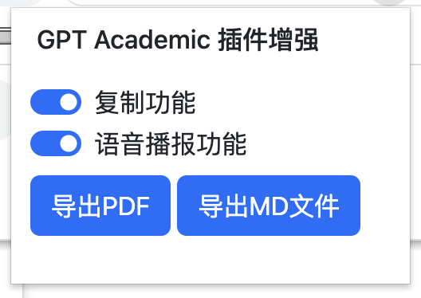
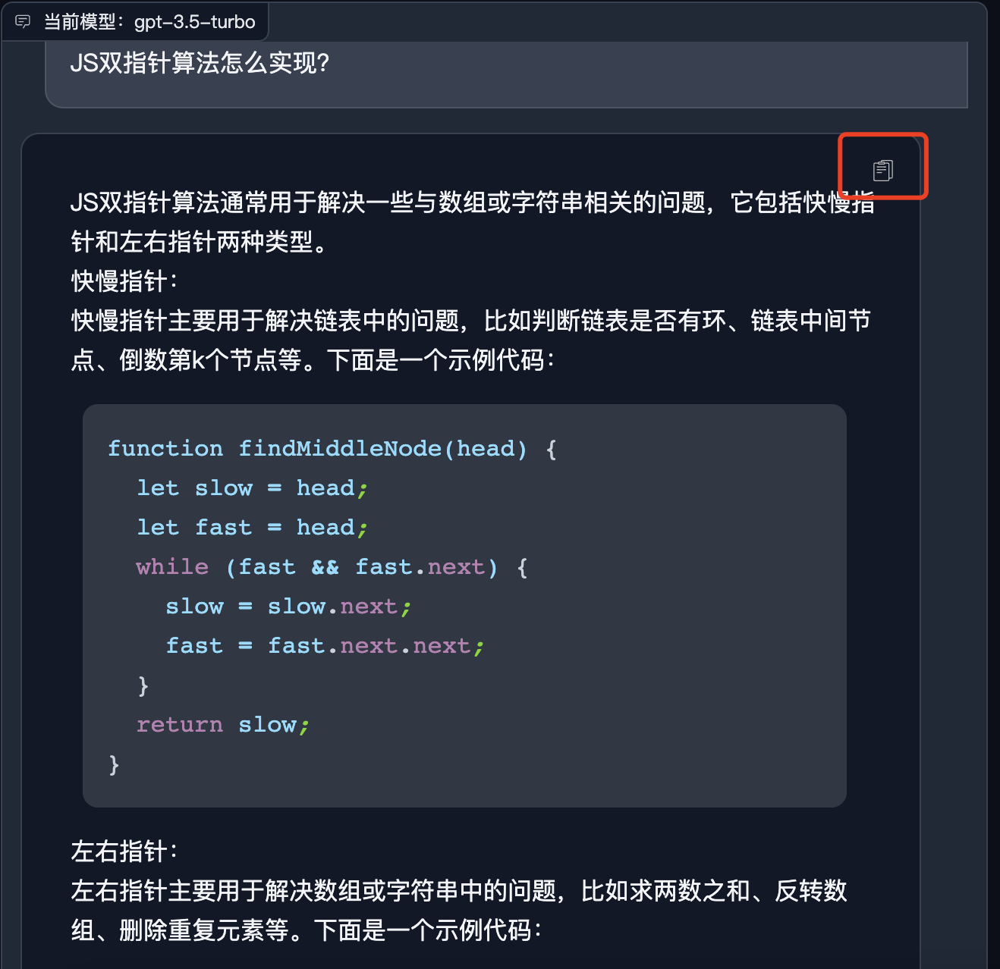
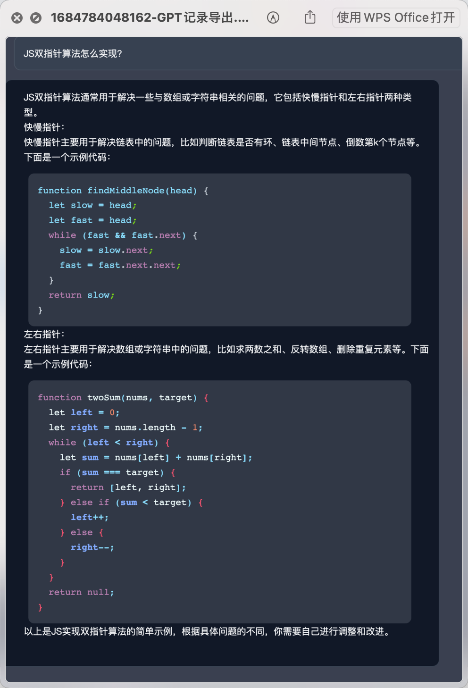
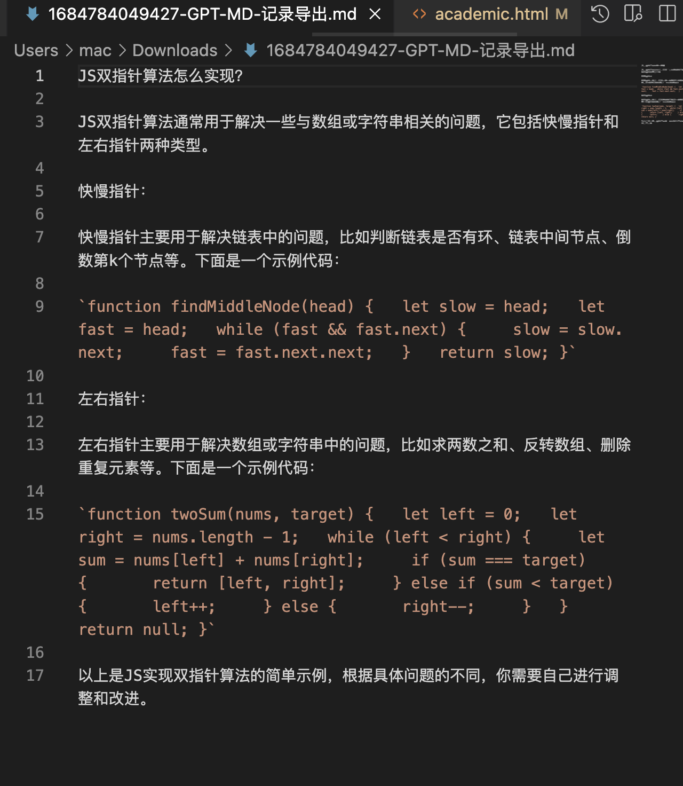

# gpt_academic chrome 插件 gpt 增强


从油猴插件中拆分出来，做一个独立整和的 chrome 插件

该插件**必须结合** gpt_academic 项目来使用

项目地址：https://github.com/binary-husky/gpt_academic

## 注意

只在黑夜模式下生效

```
 http://localhost:*/?__theme=dark
```

## 预览





### 复制功能

### PDF导出功能

### MD文件导出功能


## 如何使用与安装？

设置->扩展程序->打开开发者模式->加载已解压的扩展程序


## 包含

- 语音播放
- 内容复制
- 左侧输出保存 md
- 左侧导出 pdf

